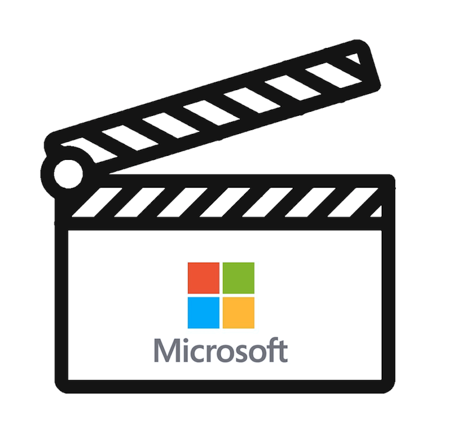
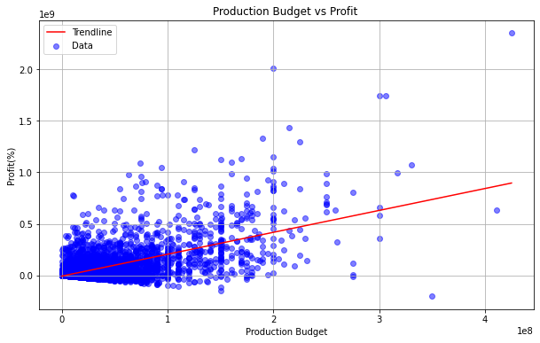
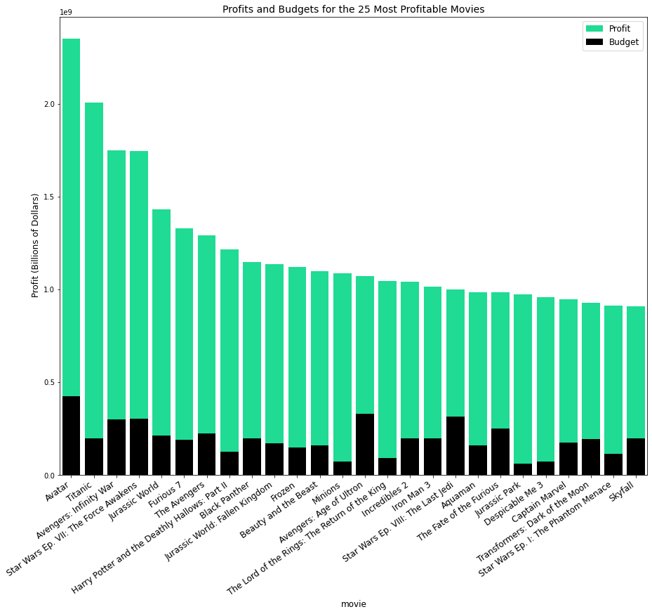
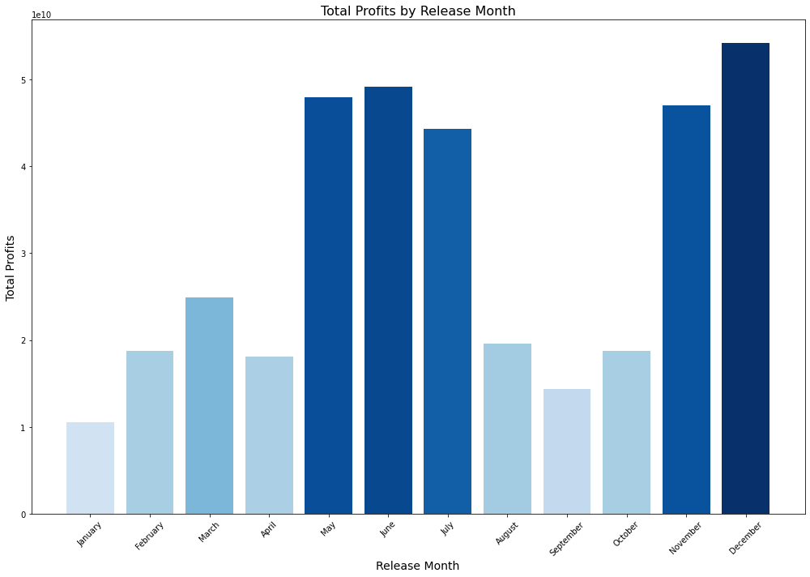
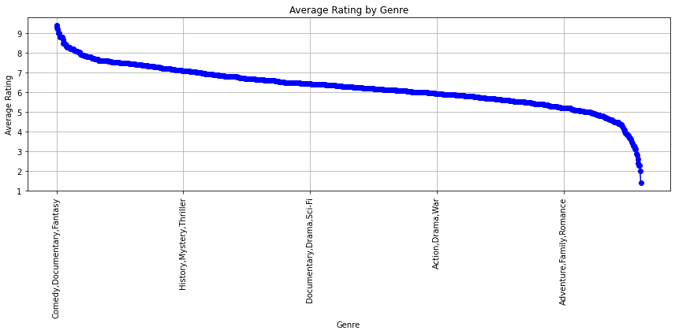
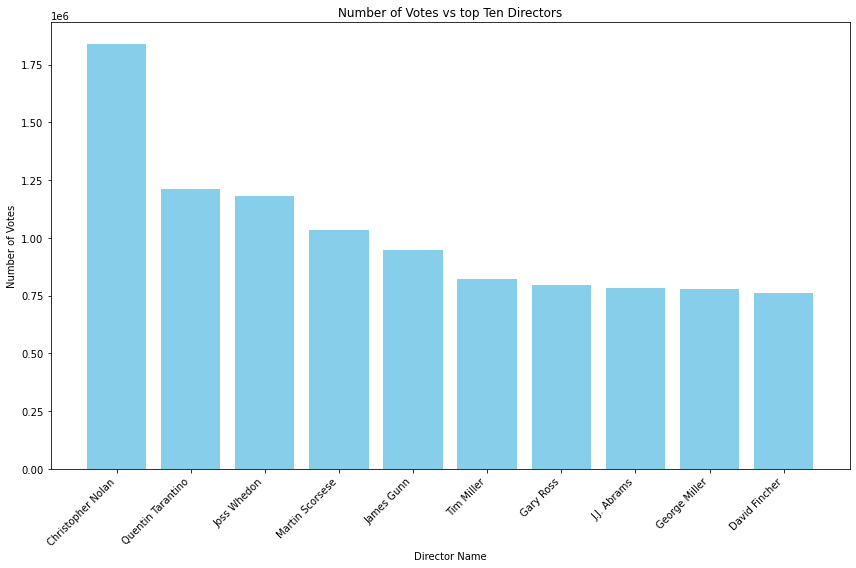
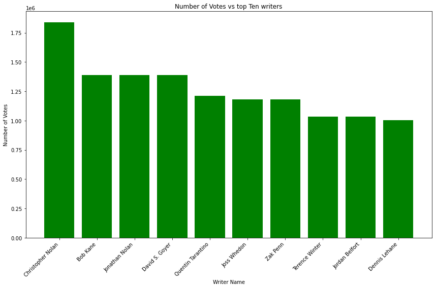

# MICROSOFT-STUDIO-EDA



#### Done by : LAARIA CHRIS

### Project Overview

Microsoft recently announced its ambitious foray into the film industry, signaling its intent to establish a dedicated studio. However, the company faces a significant challenge due to its limited understanding of the intricacies of the movie business. To address this, our mission entails comprehensive data collection, meticulous data cleaning, and rigorous analysis drawn from a plethora of sources. By synthesizing this information, we aim to furnish Microsoft with actionable insights and recommendations tailored to empower their endeavors in the film industry, fostering a pathway to sustainable success and innovation.

### Data and Exploration
In the folder zippedData are movie datasets from:

  1.https://www.boxofficemojo.com/

  2.https://www.imdb.com/

  3.https://www.rottentomatoes.com/

  4.https://www.themoviedb.org/

  5.https://www.the-numbers.com/

In this analysis we explore and answer the following questions:
1. What are the most profitable movies and how much should you spend?
2. What is the best time of the year to release a movie?
3. How does the rating of the various genres of movies fair in IMDB data?
4. Which movie directors and writers add value to the movie ratings?

# Methods 
This project uses descriptive analytics including changes in trends over time & comparitive analysis between movie features. This provides meanigul insight in movie industry trends. 

## Question 1: What are the most profitable movies and how much should you spend?
To answer this question and provide a recommendation we'll make use of a budgets dataframe called `idf_movie_budgets`. Our analysis will require that we use the data to calculate profit and profit margin.
We also calculated the return on investment as seen below.

```
# Calculate profit
df_movie_budgets['profit'] = df_movie_budgets['worldwide_gross'] - df_movie_budgets['production_budget']
# Calculate profit margin
df_movie_budgets['profit_margin'] = (df_movie_budgets['profit'] / df_movie_budgets['worldwide_gross']) * 100

# Calculate ROI (Return on Investment)
df_movie_budgets['ROI'] = (df_movie_budgets['profit'] / df_movie_budgets['production_budget']) * 100

# Display the DataFrame with the new 'ROI' column
df_movie_budgets.head()

```
We examine the overall trend of budget versus profit to see if there's any correlation.



This scatter plot is helpful in beginning to understand how much money should be budgeted for a movie. The positive trend line indicates that an increase in the budget will result in an increase in profit.

We also did an EDA on the top 25 profitable movies
```
profitable_movies_df = df_movie_budgets.loc[df_movie_budgets['profit'] > 0]
profitable_ranked_df = profitable_movies_df.sort_values(by=['profit'], ascending=False)
profitable_ranked_df.reset_index(inplace=True)
profitable_ranked_df.head()
```


**Question 1 Conclusion:** Clearly the most successful 25 movies have both incredible profits and profit margins. Titanic (1997), Avatar, and Avengers: Endgame are the most successful movies in terms of sheer profit. Microsoft should budget \$60,000,000 for a movie and that budget should correlate with a profit margin of 55\%. 

## Question 2: What is the best time of the year to release a movie?
We start by converting the dates from the `df_movie_budgets` dataframe to a datetime object.  We then do a count by month to see the number of movies released in each month.

When grouping by month, we can select the `Profit`  so that we can see which months have the most financial success.


**Question 2 Conclusion:** We recommend that Microsoft release the bulk of their movies, especially Animation, during the summer months (i.e. May-July). It appears that the summer months tend to result in greater success, perhaps as a result of an influx of children and their parents during summer break.

## Question 3: How does the rating of the various genres of movies fair in IMDB data?
In this step we will be working with the IMDB sql database.We first begin by viewing the two tables movie_basics and movie_ratings into a pandas dataframe.
Then use SQL query to obtain the data from the datasets and store them into a pandas dataframe Then w create a Line plot of the average rating vs the genre



From the above line plot it can be seen that the genre with the highest ratings are comedy, Documentary and FantasyMicrosoft Movie Studio should consider producing more content in genres like "Comedy/Documentary" and "Fantasy" as they have shown to be popular among audiences and have higher average ratings. By focusing on these genres, Microsoft can increase the chances of creating successful and well-received content.
**Question 3 Conclusion:** We recommend that Microsoft release the bulk of their movies, especially Animation, during the summer months (i.e. May-July). Adventure, Drama and Comedy movies would see similar success if released in November, but the recommendation remains to focus on summer.

## Question 4: Which movie directors and writers add value to the movie ratings?
In this section we will try to determine how directors and writers create an impact on the value of the movie. This will be seen by trying to relate the directors and writers to the movie ratings.



The directors listed, such as Christopher Nolan, Quentin Tarantino, and Martin Scorsese, have garnered significant attention and praise from audiences, as indicated by the high number of votes received for their works. This suggests that these directors have a strong reputation and a dedicated fan base. Collaborating with renowned directors like these can enhance the credibility and appeal of the movies produced by Microsoft Movie Studio.I also did the same for the top writers below



The above are the top ten writers that microsoft should engage with.Partnering with top writers offers an opportunity for Microsoft Movie Studio to produce high-quality content that resonates with audiences. 

**Question 4 Conclusion:** We recommend that Microsoft  engage these  directors & writers who have demonstrated their ability to craft compelling narratives, innovate in storytelling techniques, and deliver memorable cinematic experiences. By collaborating with them, Microsoft Movie Studio can create content that stands out in the competitive entertainment industry.


# Recommendations  
Based on these findings the recommendations to Microsoft are as follows: 
1. Microsoft should budget around 60 million dollars to start the movie production. 

2. In order to optimize profit potential, Microsoft should emulate the top five highest earning movies in at   least half  of their first-year productions.

3. Microsoft should  produce comedy, documentaries and fantasy
4. Microsoft should engage top directors and writers of top rated movies

# Future Work
Given addional time I would pursue the following: 

1. Foreign Gross: Analyze the foreign markets by genre, country, rating, and release date to better understand global trends. 

2. Sentimentality: Measure the sentimentality of Rotten Tomatoes and other reviews and explore relationship
 to movie gross.  
3. Art House Films: Look at successful low-budget movies to make an indie film recommendation to Microsoft.

4. Webscraping of data from online sources.
